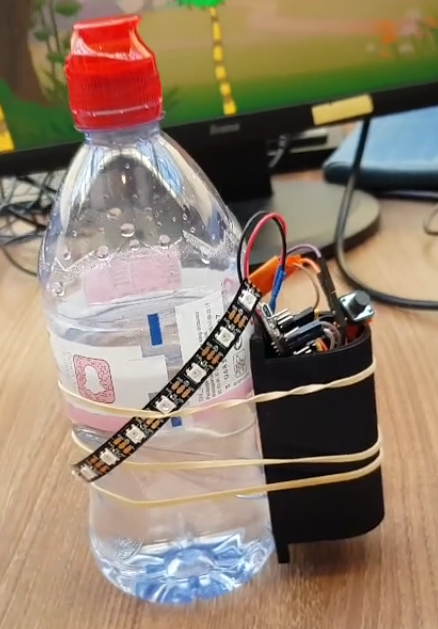
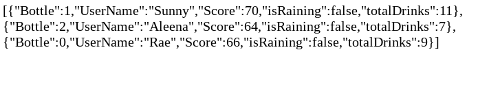
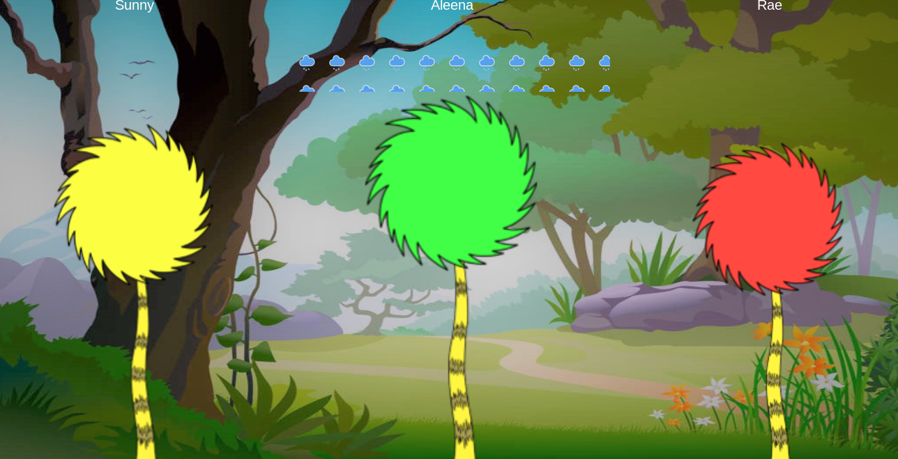

An arduino-enhanced water bottle, with a socially-growing forest, to enhance social interaction of hydration, for COMSM0009 Interactive Devices.

---

## Youtube Demo

<iframe width="560" height="315" src="https://www.youtube.com/embed/FimLVj6nT68" frameborder="0" allow="accelerometer; autoplay; encrypted-media; gyroscope; picture-in-picture" allowfullscreen></iframe>

---

## Components

### Bottle
Arduino code that registers a tilt on the accelerometer and calls the backend API to register that a particular bottle has been drunk from.

### Backend
An API based on a series of HTTP GET calls, to both register drinks and create a JSON for the output, as well as a series of database-updating and -resetting calls for user info.

### Frontend
A dynamically-scaling forest that uses the backend-supplied JSON to decide on tree size, names and animations.

Hosted at [lukestorry.co.uk/waTree/display.html](https://lukestorry.co.uk/waTree/display.html)
